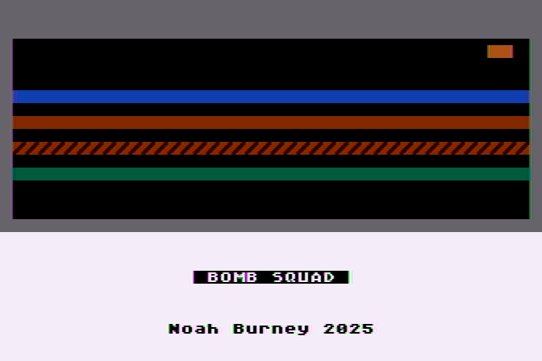
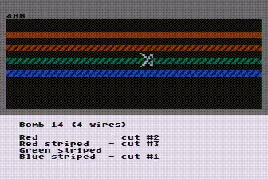
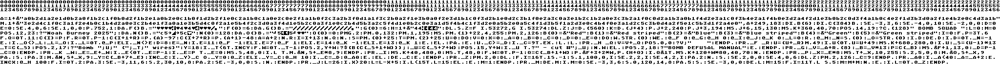
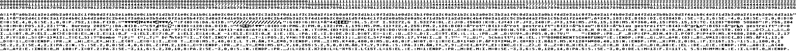
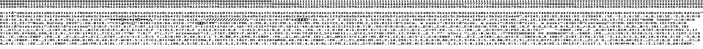

Game for Atari 8-bit computers, in 10 lines of [FastBasic](https://github.com/dmsc/fastbasic). Created for 2025 [Basic 10 Liner contest](https://basic10liner.com).

# Bomb Squad
Beep...beep...beep... Defuse the bomb before it explodes!

Consult your Bomb Defusal Manual to identify the correct bomb, and cut the wires in precisely the right order.

One mistake and it's all over!

### Requirements

- Atari 400/800/XL/XE computer or emulator (Altirra, Atari800MacX, etc.)
- Joystick

Starting the game:
In emulator: drag-and-drop .xex file onto emulator window. Via FujiNet: mount .xex file in D1: and reboot. A8PicoCart or similar: select .xex file to boot.

## How to Play

1. Press fire button to start
2. Move joystick left or right to flip through the pages of the Bomb Defusal Manual
3. Find the page describing the bomb displayed at the top. Be sure to match exact number and colors of the wires.
4. Move the joystick up and down to select a wire
5. Referring to the manual, press the fire button to cut the wires according the specific order
6. Once you've cut all the correct wires, the light will flash green and beep, indicating it has been defused.
7. Press fire button to get a new bomb
8. If you cut the wrong wire, the bomb explodes and the game is over!

## Source Code
This game was developed using [FastBasic 4.7](https://github.com/dmsc/fastbasic). The full, annotated, non-condensed, [code is available here](https://github.com/nwah/basic-10liner-bomb-squad/blob/main/src/bomb-squad-ntsc.bas).

English / NTSC version:

German / PAL version:

Polish / PAL version:

## Acknowledgements
Thank you to Eric Carr for sharing his source code image generator, and also for providing very helpfully annotated FastBasic programs in previous years. Thank you to DjayBee and Peter Kaczorowski for checking my translations.
